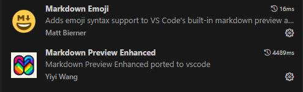

#### Readme file details
  - using markdown syntax
  - save file wid .md extention
  - install Markdown Emoji and Markdown Preview Enhanced extentions
  - refer webFx site for emoji discription. link: <https://www.webfx.com/tools/emoji-cheat-sheet/>

  Extention screenshot :
  

#### Syntax 

  - \# : for header use upto 6 \# for resize
  - \*text* : to make text italic
  - \*\*text**: to make text bold
  - \<link> : for web link
  - \- : for list
  - 1\. : for order list
  - \![alt]\(path) - for image (alt = alternate text of image)
  - \`code` : for programming language
  - \`\`\`lang name
    code
    \`\`\` : for multiline coding

  - :emoji: : for emoji